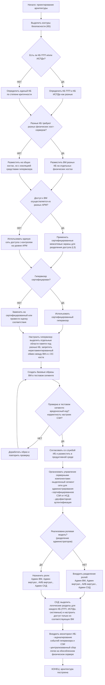

```mermaid
graph TD
    A["Начало: проектирование архитектуры"] --> B["Выделить контуры безопасности (КБ)"]
    B --> C{"Есть ли КБ ПТП и/или ИСПДн?"}
    C -->|ДА| D["Определить КБ ПТП и КБ ИСПДн как разные"]
    C -->|НЕТ| E["Определить единый КБ по степени критичности"]
    D --> F{"Разные КБ требуют разных физических хост-серверов?"}
    E --> F
    F -->|ДА| G["Разместить ВМ разных КБ на отдельных физических хостах"]
    F -->|НЕТ| H["Разместить на общих хостах, но с изоляцией средствами гипервизора"]
    G --> I{"Доступ к ВМ осуществляется из разных АРМ?"}
    H --> I
    I -->|ДА| J["Применить сертифицированные межсетевые экраны для разделения доступа (L3)"]
    I -->|НЕТ| K["Использовать единую сеть доступа с контролем на уровне АРМ"]
    J --> L{"Гипервизор сертифицирован?"}
    K --> L
    L -->|ДА| M["Использовать сертифицированный гипервизор"]
    L -->|НЕТ| N["Заменить на сертифицированный или провести оценку соответствия"]
    M --> O["Настроить гипервизор: выделить отдельные области памяти под разные КБ; запретить нерегламентированный обмен между ВМ и с ОС хоста"]
    N --> O
    O --> P["Создать базовые образы ВМ в тестовом сегменте"]
    P --> Q{"Проверка в тестовом сегменте:<br>вредоносный код?<br>корректность настроек СЗИ?"}
    Q -->|НЕТ| R["Доработать образ и повторить проверку"]
    R --> P
    Q -->|ДА| S["Согласовать со службой ИБ и разместить в продуктивной среде"]
    S --> T["Организовать управление серверными компонентами:<br>- выделенный сегмент сети для администрирования<br>- сертифицированное СЗИ от НСД<br>- двухфакторная аутентификация"]
    T --> U{"Реализована ролевая модель?<br>(разделение администраторов)"}
    U -->|НЕТ| V["Внедрить разделение ролей:<br>Админ ВМ, Админ виртуал., АИБ виртуал., Админ СХД"]
    U -->|ДА| W["Назначить роли:<br>Админ ВМ, Админ виртуал., АИБ виртуал., Админ СХД"]
    V --> X["СХД: выделить логические разделы для каждого КБ (ПТП, ИСПДн, системные) и настроить доступ только из соответствующих ВМ"]
    W --> X
    X --> Y["Внедрить мониторинг ИБ:<br>- журналирование событий гипервизора и СЗИ<br>- централизованный сбор логов на обособленном физическом сервере"]
    Y --> Z["КОНЕЦ: архитектура построена"]
```
