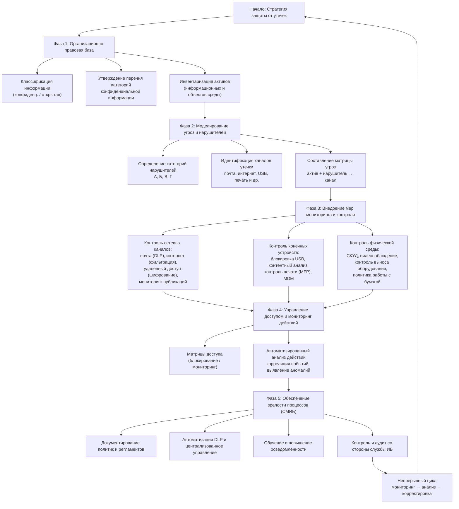

```mermaid
graph TD
    A["Начало: Стратегия защиты от утечек"] --> B["Фаза 1: Организационно-правовая база"]
    B --> B1["Классификация информации\n(конфиденц. / открытая)"]
    B --> B2["Утверждение перечня категорий\nконфиденциальной информации"]
    B --> B3["Инвентаризация активов\n(информационных и объектов среды)"]
    
    B3 --> C["Фаза 2: Моделирование угроз и нарушителей"]
    C --> C1["Определение категорий нарушителей\nА, Б, В, Г"]
    C --> C2["Идентификация каналов утечки\nпочта, интернет, USB, печать и др."]
    C --> C3["Составление матрицы угроз\nактив + нарушитель → канал"]

    C3 --> D["Фаза 3: Внедрение мер мониторинга и контроля"]
    D --> D1["Контроль сетевых каналов:\nпочта (DLP), интернет (фильтрация),\nудалённый доступ (шифрование),\nмониторинг публикаций"]
    D --> D2["Контроль конечных устройств:\nблокировка USB, контентный анализ,\nконтроль печати (MFP), MDM"]
    D --> D3["Контроль физической среды:\nСКУД, видеонаблюдение,\nконтроль выноса оборудования,\nполитика работы с бумагой"]

    D1 & D2 & D3 --> E["Фаза 4: Управление доступом и мониторинг действий"]
    E --> E1["Матрицы доступа\n(блокирование / мониторинг)"]
    E --> E2["Автоматизированный анализ действий\nкорреляция событий, выявление аномалий"]

    E2 --> F["Фаза 5: Обеспечение зрелости процессов (СМИБ)"]
    F --> F1["Документирование политик и регламентов"]
    F --> F2["Автоматизация DLP и централизованное управление"]
    F --> F3["Обучение и повышение осведомленности"]
    F --> F4["Контроль и аудит со стороны службы ИБ"]

    F4 --> G["Непрерывный цикл\nмониторинг → анализ → корректировка"]
    G --> A
```
